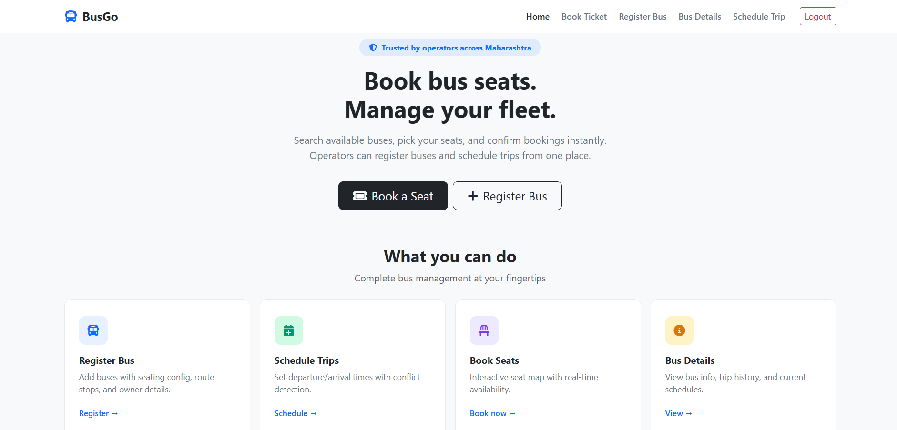
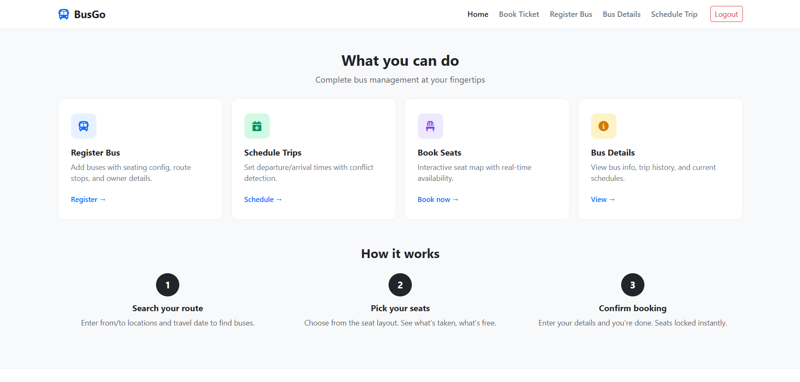
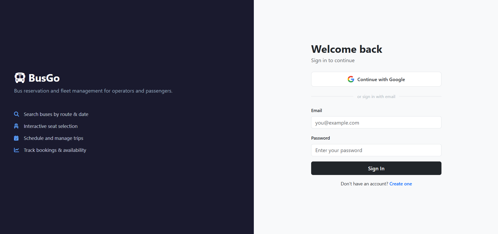
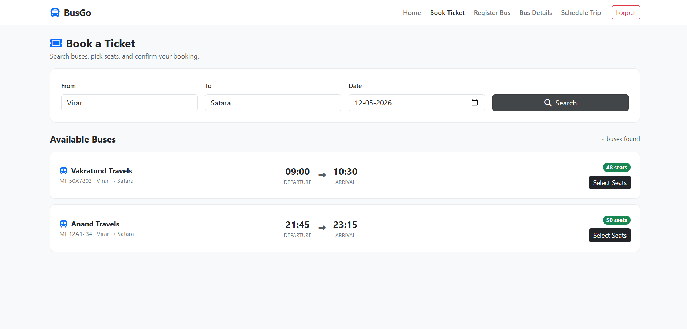
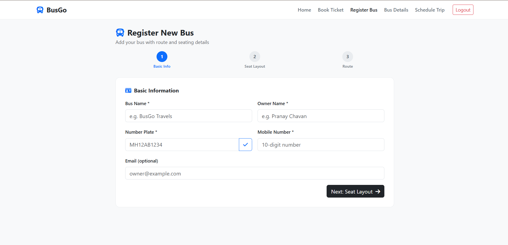
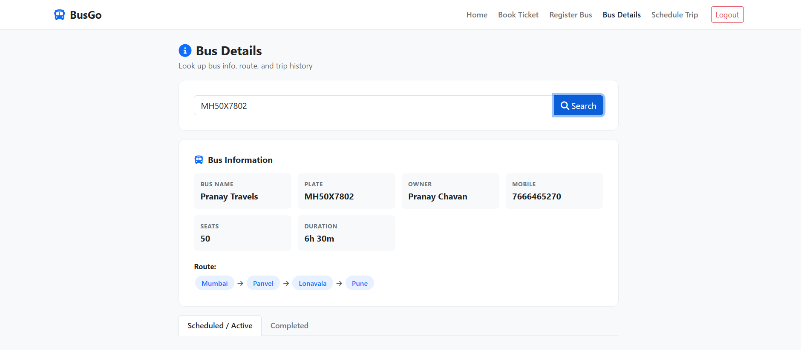
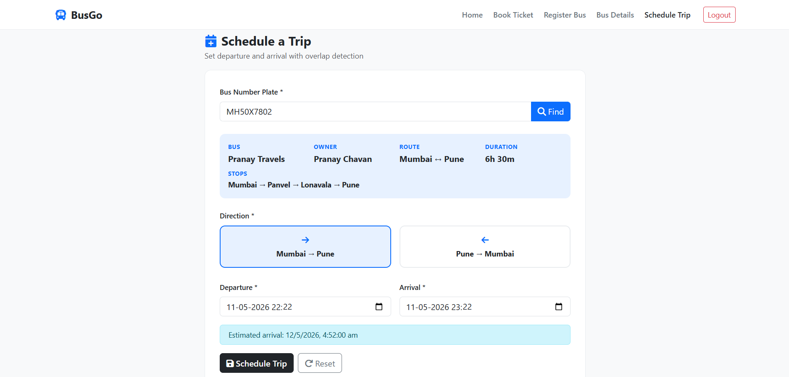

# 🚌 BusGo — Bus Reservation System

A complete **bus reservation management** built using **Spring Boot**, **Spring**, **JSP** and **MySQL**.  
The system allows operators to register buses, manage routes, schedule trips and enables passengers to search buses and reserve seats with real-time availability tracking.

---

# 🚀 Features
- 🚌 Dynamic bus registration and seat layout generation
- 🗺️ Route and stop management
- 📅 Trip scheduling with overlap validation
- 🎟️ Real-time seat booking system
- 📊 Seat availability tracking
- ⏱️ Automated trip status scheduler
- ✅ Input validation using Bean Validation
- ⚠️ Global exception handling

---

# 🧱 Tech Stack

## ⚙️ Backend

- Java 17
- Spring Boot 2.7.14
- Spring MVC
- Spring Data JPA
- Hibernate ORM

## 🗄️ Database

- MySQL 8

## 🎨 Frontend

- JSP
- HTML5
- CSS3
- Bootstrap 5.3

## 🛠️ Build & Deployment

- Maven
- WAR Packaging
- Embedded Tomcat Server

---

# 📸 Screenshots

## Home Page




## Login Page



## Book Ticket Page



## Register Bus 



## Bus Details & Seat Layout



## Trip Scheduling Page



---

# 📁 Project Structure

```text
BusApp/
│
├── .mvn/                               # Maven wrapper files
├── src/
│   ├── main/
│   │   ├── java/com/busreservation/
│   │   │   ├── config/                 # Security & exception configuration
│   │   │   ├── controller/             # MVC and REST controllers
│   │   │   ├── dto/                    # Request/response DTO classes
│   │   │   ├── model/                  # JPA entity classes
│   │   │   ├── repository/             # Spring Data JPA repositories
│   │   │   ├── scheduler/              # Automated schedulers
│   │   │   ├── service/                # Business logic layer
│   │   │   └── BusReservationApplication.java
│   │   │
│   │   ├── resources/
│   │   │   └── application.properties
│   │   │
│   │   └── webapp/
│   │       └── WEB-INF/views/          # JSP frontend pages
│   │
│   └── test/
│       └── java/com/busreservation/    # Unit and integration tests
│
├── screenshots/                        # Application screenshots
├── pom.xml                             # Maven dependencies
├── mvnw
├── mvnw.cmd
└── README.md
 ```

---
## Setup

### Prerequisites

- JDK 17
- Maven 3.6+
- MySQL 8 running locally

### 1. Database

```sql
CREATE DATABASE bus_reservation_db;
```

Default credentials in `application.properties` are `root` / `root`. Change username and password accroding to need.

### 2. Login using email and password

### 3. Run

```bash
mvn clean spring-boot:run
```

Or build and run the WAR:

```bash
mvn clean package -DskipTests
java -jar target/bus-reservation-system-1.0.0.war
```

App runs at `http://localhost:8080`. You will be redirected to `/login` first.


## API Endpoints

| Method | Path | Purpose |
|--------|------|---------|
| POST | `/api/auth/signup` | Register new user |
| POST | `/api/bus/register` | Register a bus |
| GET  | `/api/bus/check-plate` | Check plate availability |
| GET  | `/api/bus/details` | Get bus info + trips |
| POST | `/api/bus/search` | Search available trips |
| POST | `/api/trip/schedule` | Schedule a trip |
| POST | `/api/seats/layout` | Get seat layout for a trip |
| POST | `/api/booking/confirm` | Confirm seat booking |

## Contributor

- **Pranay Chavan** 
